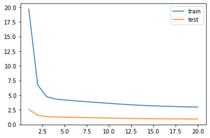
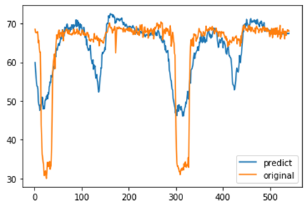
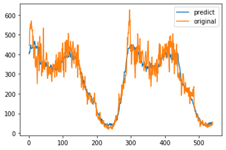

### 循环神经网络实验数据集说明

实验采用Caltrans Performance Measurement System（PeMS）数据集http://pems.dot.ca.gov/，本实验使用第四区（4 district）的数据，数据格式为npz压缩形式，使用numpy库load函数即可加载。

该数据集收集自部署于城市的探测器，每个探测器每隔 $30s$ 收集一次数据，每个探测器监测属性包括车流量（Traffic Flow (Volume)）、拥挤程度（Occupancy）以及速度（Speed），第四区数据共307个探测器，因此数据维度为 $(16992, 307, 3)$。

参考：https://github.com/mas-dse-c6sander/DSE_Cohort2_Traffic_Capstone/wiki/PeMS-Data-Information

### 模型最终结果

批次设置为36，eoch设置为20，采用随机梯度下降进行优化训练，学习率设置为0.1，循环神经网络在训练集以及测试集上的loss变化如下图所示。

由于预测结果是307个探测器在未来1min内的速度、车流量、拥挤程度，因此选取第一个探测器的数据，观察模型在测试集上540min内的预测结果。

速度预测与真实对比图

车流量预测与真实对比图

拥挤程度预测与真实对比图
